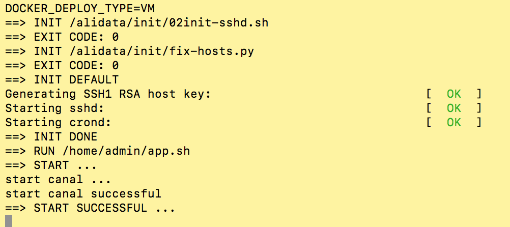

# 直接安装-QuickStart

## 准备
* 对于自建 MySQL , 需要先开启 Binlog 写入功能，配置 binlog-format 为 ROW 模式，my.cnf 中配置如下

    ```shell script
    [mysqld]
    log-bin=mysql-bin # 开启 binlog
    binlog-format=ROW # 选择 ROW 模式
    server_id=1 # 配置 MySQL replaction 需要定义，不要和 canal 的 slaveId 重复
    ```

* 注意：针对阿里云 RDS for MySQL , 默认打开了 binlog , 并且账号默认具有 binlog dump 权限 , 不需要任何权限或者 binlog 设置,可以直接跳过这一步

* 授权 canal 链接 MySQL 账号具有作为 MySQL slave 的权限, 如果已有账户可直接 grant

    ```mysql
    CREATE USER canal IDENTIFIED BY 'canal';  
    GRANT SELECT, REPLICATION SLAVE, REPLICATION CLIENT ON *.* TO 'canal'@'%';
    -- GRANT ALL PRIVILEGES ON *.* TO 'canal'@'%' ;
    FLUSH PRIVILEGES;
    ```

## 启动
   
* 下载 canal, 访问 release 页面 , 选择需要的包下载, 如以 1.0.17 版本为例

    ```shell script
    wget https://github.com/alibaba/canal/releases/download/canal-1.0.17/canal.deployer-1.0.17.tar.gz
    ```
- 解压缩

    ```shell script
    mkdir /tmp/canal
    tar zxvf canal.deployer-$version.tar.gz  -C /tmp/canal
    ```

    * 解压完成后，进入 /tmp/canal 目录，可以看到如下结构
    
        ```shell script
        drwxr-xr-x 2 jianghang jianghang  136 2013-02-05 21:51 bin
        drwxr-xr-x 4 jianghang jianghang  160 2013-02-05 21:51 conf
        drwxr-xr-x 2 jianghang jianghang 1.3K 2013-02-05 21:51 lib
        drwxr-xr-x 2 jianghang jianghang   48 2013-02-05 21:29 logs
        ```

- 配置修改
    ```shell script
    vi conf/example/instance.properties
    ```
    ```shell script
    ## mysql serverId
    canal.instance.mysql.slaveId = 1234
    #position info，需要改成自己的数据库信息
    canal.instance.master.address = 127.0.0.1:3306 
    canal.instance.master.journal.name = 
    canal.instance.master.position = 
    canal.instance.master.timestamp = 
    #canal.instance.standby.address = 
    #canal.instance.standby.journal.name =
    #canal.instance.standby.position = 
    #canal.instance.standby.timestamp = 
    #username/password，需要改成自己的数据库信息
    canal.instance.dbUsername = canal  
    canal.instance.dbPassword = canal
    canal.instance.defaultDatabaseName =
    canal.instance.connectionCharset = UTF-8
    #table regex
    canal.instance.filter.regex = .\*\\\\..\*
    ```

    - canal.instance.connectionCharset 代表数据库的编码方式对应到 java 中的编码类型，比如 UTF-8，GBK , ISO-8859-1
    - 如果系统是1个 cpu，需要将 canal.instance.parser.parallel 设置为 false
- **启动**
    ```shell script
    sh bin/startup.sh
    ```

- 查看 server 日志

    ```shell script
    vi logs/canal/canal.log</pre>
    ```
    ```shell script
    2013-02-05 22:45:27.967 [main] INFO  com.alibaba.otter.canal.deployer.CanalLauncher - ## start the canal server.
    2013-02-05 22:45:28.113 [main] INFO  com.alibaba.otter.canal.deployer.CanalController - ## start the canal server[10.1.29.120:11111]
    2013-02-05 22:45:28.210 [main] INFO  com.alibaba.otter.canal.deployer.CanalLauncher - ## the canal server is running now ......
    ```
  
- 查看 instance 的日志
    ```shell script
    vi logs/example/example.log
    ```
    ```shell script
    2013-02-05 22:50:45.636 [main] INFO  c.a.o.c.i.spring.support.PropertyPlaceholderConfigurer - Loading properties file from class path resource [canal.properties]
    2013-02-05 22:50:45.641 [main] INFO  c.a.o.c.i.spring.support.PropertyPlaceholderConfigurer - Loading properties file from class path resource [example/instance.properties]
    2013-02-05 22:50:45.803 [main] INFO  c.a.otter.canal.instance.spring.CanalInstanceWithSpring - start CannalInstance for 1-example 
    2013-02-05 22:50:45.810 [main] INFO  c.a.otter.canal.instance.spring.CanalInstanceWithSpring - start successful....
    ```

- 关闭

    ```shell script
    sh bin/stop.sh
    ```
- 参考
    - https://github.com/alibaba/canal/wiki/QuickStart

# docker安装 QuickStart
    
## Dockerfile
Dockerfile文件：https://github.com/alibaba/canal/blob/master/docker/Dockerfile 注意点：

- 基于centos6.7最小镜像进行构建，安装一些必须的工具，比如tar/dstat/nc/man等，大概400MB
- 默认安装jdk 1.8，build.sh脚本里会自动下载jdk然后copy到docker里，大概400MB
- 自带日志清理脚本，会识别硬盘超过80%时，自动清理
因此，canal整个docker镜像在900MB左右，有一定的优化空间，比如使用jre、减少一些非必须的命令等

## 获取Docker
### 远程拉取
   1. 访问docker hub获取最新的版本 访问：https://hub.docker.com/r/canal/canal-server/tags/

   2. 下载对应的版本，比如最新版为1.1.5（我们系统采用的版本是1.1.4）
        > docker pull canal/canal-server:v1.1.1
    
### 本地编译
    ```shell script
    git clone git@github.com:alibaba/canal.git
    cd canal/docker && sh build.sh
    ```

### 启动Docker
docker目录下自带了一个run.sh脚本: https://github.com/alibaba/canal/blob/master/docker/run.sh

```shell script
sh run.sh 
Usage:
  run.sh [CONFIG]
example:
  run.sh -e canal.instance.master.address=127.0.0.1:3306 \
         -e canal.instance.dbUsername=canal \
         -e canal.instance.dbPassword=canal \
         -e canal.instance.connectionCharset=UTF-8 \
         -e canal.instance.tsdb.enable=true \
         -e canal.instance.gtidon=false \
         -e canal.instance.filter.regex=.*\\..* 
```

实际运行的例子：
```shell script
# 下载脚本
wget https://raw.githubusercontent.com/alibaba/canal/master/docker/run.sh 

# 构建一个destination name为test的队列
sh run.sh -e canal.auto.scan=false \
          -e canal.destinations=test \
          -e canal.instance.master.address=127.0.0.1:3306  \
          -e canal.instance.dbUsername=canal  \
          -e canal.instance.dbPassword=canal  \
          -e canal.instance.connectionCharset=UTF-8 \
          -e canal.instance.tsdb.enable=true \
          -e canal.instance.gtidon=false  \
```

注意点：

- -e参数里可以指定以前canal.properties/instance.properties里的所有配置的key和value，canal-server启动时会有限读取-e指定的变量，具体可参考AdminGuide
- **docker模式下，单docker实例只能运行一个instance，主要为配置问题。如果需要运行多instance时，可以自行制作一份docker镜像即可**
    
### 运行效果


看到successful之后，就代表canal-server启动成功，可以启动canal-client链接上来进行binlog订阅了

### 链接
- https://github.com/alibaba/canal/wiki/Docker-QuickStart

# 常见问题
- 修改偏移量问题
    - 单机情况下
        - 偏移量未存储到zk的情况下
            ```shell script
            到instance下  
                rm meta.dat  #记录偏移量的文件
                rm h2.mv.db  
            到bin路径下   
                ./restart.sh
            ```
         - 偏移量存储到zk的情况下
            - 可直接修改zk上的偏移量
            
- mysql 版本问题
    - 具体针对不同版本数据库做不同的修改
        - v 5.6
            > mysql5.6版本   canal在处理监听数据库数据时，获取的是整个编辑修改删除的sql
              假如需要处理，需要重新分割sql数据 
        - v 5.7
            > mysql5.7版本   canal在处理数据库时，数据是存储在对象中 rowChange.getRowDatasList()

- 表结构变更的处理
    - TSDB
        - 需要关注一下这个东西
            > https://github.com/alibaba/canal/wiki/TableMetaTSDB
                   
- 关注java.sql.Types 这个包对应canal传输的字段数据类型，canal中使用sqlType来判断字段类型
                  
- 数据格式
    ```shell script
    Entry  
        Header  
            logfileName [binlog文件名]  
            logfileOffset [binlog position]  
            executeTime [binlog里记录变更发生的时间戳,精确到秒]  
            schemaName   
            tableName  
            eventType [insert/update/delete类型]  
        entryType   [事务头BEGIN/事务尾END/数据ROWDATA]  
        storeValue  [byte数据,可展开，对应的类型为RowChange]  
    RowChange
    
    isDdl       [是否是ddl变更操作，比如create table/drop table]
    
    sql         [具体的ddl sql]
    
    rowDatas    [具体insert/update/delete的变更数据，可为多条，1个binlog event事件可对应多条变更，比如批处理]
    
    beforeColumns [Column类型的数组，变更前的数据字段]
    
    afterColumns [Column类型的数组，变更后的数据字段]
    
    
    Column
    
    index
    
    sqlType     [jdbc type]
    
    name        [column name]
    
    isKey       [是否为主键]
    
    updated     [是否发生过变更]
    
    isNull      [值是否为null]
    
    value       [具体的内容，注意为string文本]  
    ```       
    - 可以提供数据库变更前和变更后的字段内容，针对binlog中没有的name,isKey等信息进行补全
    - 可以提供ddl的变更语句
    - **insert只有after columns, delete只有before columns，而update则会有before / after columns数据. **

    - 链接
        - https://github.com/alibaba/canal/wiki/ClientAPI
        
        