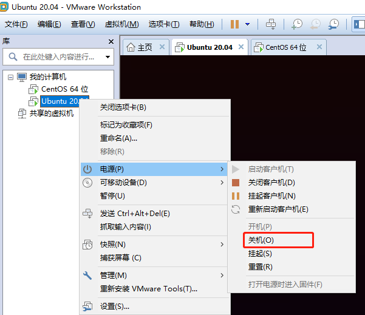
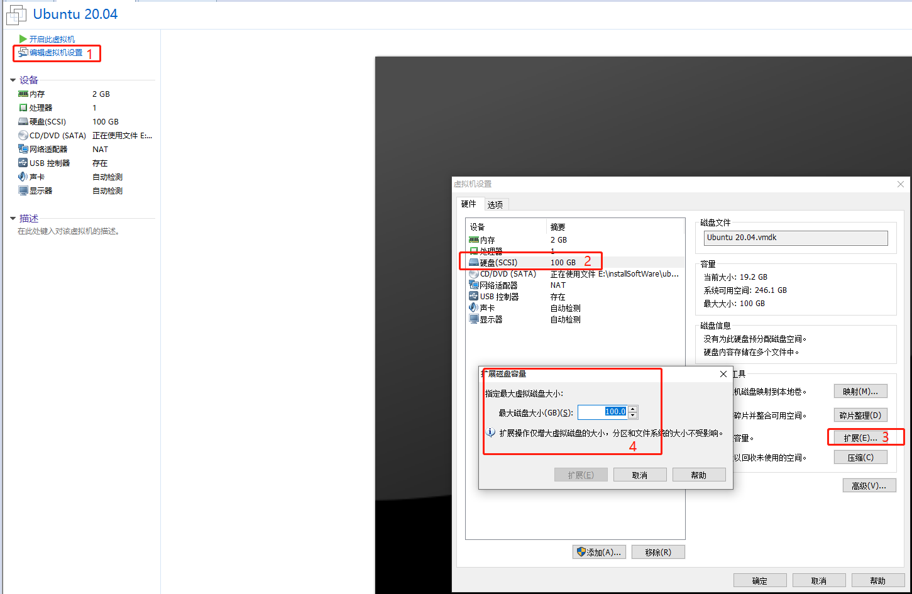
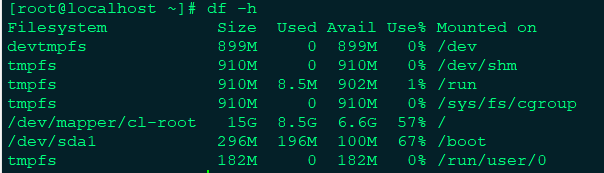
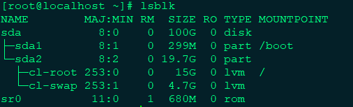
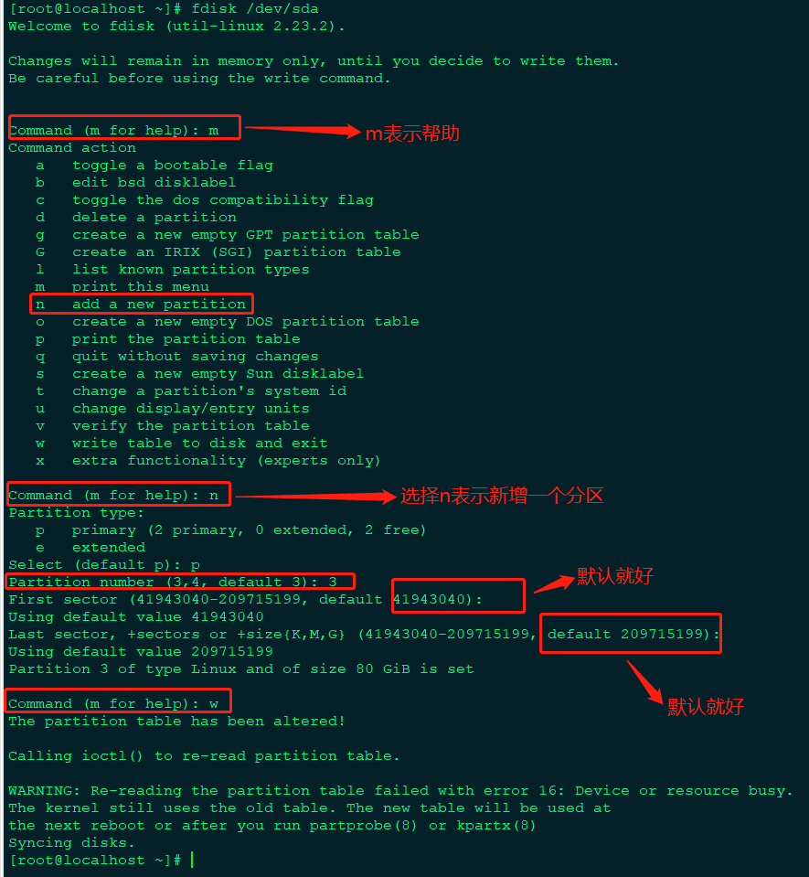
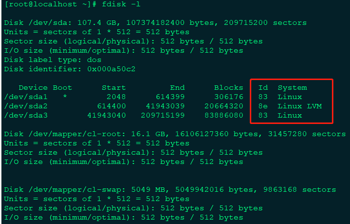
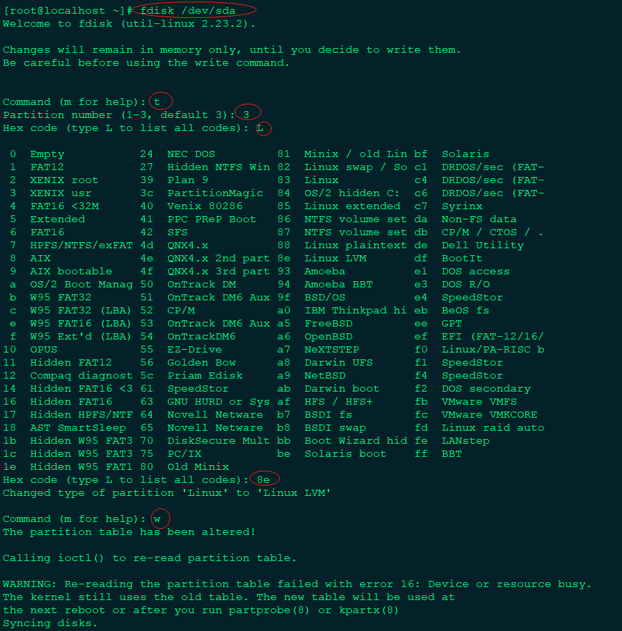
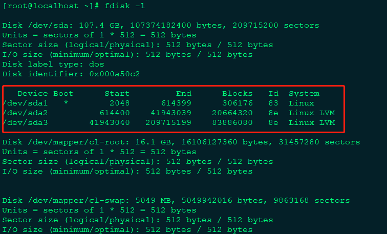
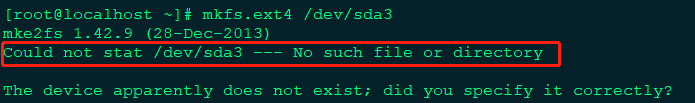
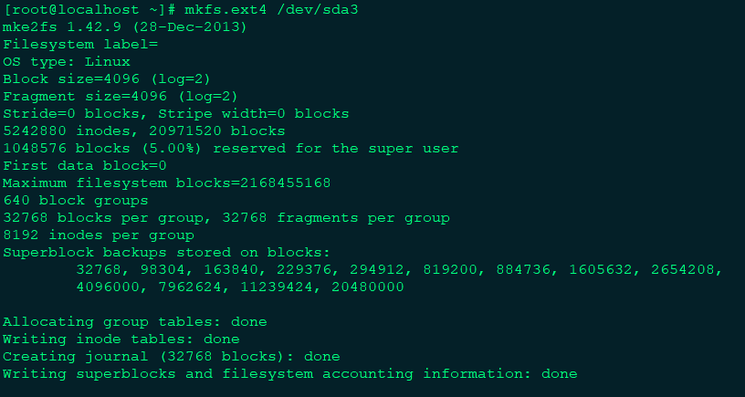

# 虚拟机扩容centos磁盘空间


## 1.停止运行虚拟机



进行虚拟机磁盘扩容



## 2.通过xhell查看磁盘占用情况





> 执行查看发现sda未进行分区，需要手动分区




## 3.设置sda3磁盘空间为我们的可用空间



> 通过执行命令：`fdisk -l`发现sda3的id是83，我们需要将sda3的id的system改成和sda2一样

## 4.修改sda3的id和system



> 如上图运行命令：`fdisk /dev/sda`,执行参数: t->3->L->8e->w

## 5.再次查看磁盘分区情况



## 6.将文件格式改为ext4



> 注意:如果执行命令`mkfs.ext4 /dev/sda3`出现如上图错误，是因为你的内核没有和分区同步，所以可以在终端直接输入`partprobe`重新读取分区表即可，然后再次执行命令：`mkfs.ext4 /dev/sda3`，如下图所示：



## 7.开始扩容

创建物理卷：
```shell script
[root@localhost ~]# lvm
lvm> pvcreate /dev/sda3
  Physical volume "/dev/sda3" successfully created.
```
查看物理卷和卷组
```shell script
lvm> pvdisplay
  --- Physical volume ---
  PV Name               /dev/sda2
  VG Name               cl
  PV Size               <19.71 GiB / not usable 4.00 MiB
  Allocatable           yes (but full)
  PE Size               4.00 MiB
  Total PE              5044
  Free PE               0
  Allocated PE          5044
  PV UUID               56VXT2-7Upz-xeTP-Hatp-ujSP-Cql7-tX6sai
   
  --- Physical volume ---
  PV Name               /dev/sda3
  VG Name               cl
  PV Size               80.00 GiB / not usable 4.00 MiB
  Allocatable           yes (but full)
  PE Size               4.00 MiB
  Total PE              20479
  Free PE               0
  Allocated PE          20479
  PV UUID               f8qO5K-U8Qw-YdBo-SeLd-wUTd-BTt6-2rafA9
   
  "/dev/sda4" is a new physical volume of "50.00 GiB"
  --- NEW Physical volume ---
  PV Name               /dev/sda4
  VG Name               
  PV Size               50.00 GiB
  Allocatable           NO
  PE Size               0   
  Total PE              0
  Free PE               0
  Allocated PE          0
  PV UUID               Tf4seX-qvRT-ECw1-JqsE-BlzO-1d08-f1fH0d
   
lvm> vgdisplay
  --- Volume group ---
  VG Name               cl
  System ID             
  Format                lvm2
  Metadata Areas        2
  Metadata Sequence No  5
  VG Access             read/write
  VG Status             resizable
  MAX LV                0
  Cur LV                2
  Open LV               1
  Max PV                0
  Cur PV                2
  Act PV                2
  VG Size               <99.70 GiB
  PE Size               4.00 MiB
  Total PE              25523
  Alloc PE / Size       25523 / <99.70 GiB
  Free  PE / Size       0 / 0   
  VG UUID               Z6t5fR-SfFQ-CyBk-UhHs-xWyx-hdk4-ejdgCM
```

将物理卷加入到卷组：

> vgenxtend [1] [2]  1:为查询出来的VG Name  2：为新添加的磁盘
```shell script
lvm> vgextend cl /dev/sda4
  Volume group "cl" successfully extended
lvm> vgdisplay
  --- Volume group ---
  VG Name               cl
  System ID             
  Format                lvm2
  Metadata Areas        3
  Metadata Sequence No  7
  VG Access             read/write
  VG Status             resizable
  MAX LV                0
  Cur LV                2
  Open LV               1
  Max PV                0
  Cur PV                3
  Act PV                3
  VG Size               <149.70 GiB
  PE Size               4.00 MiB
  Total PE              38322
  Alloc PE / Size       38322 / <149.70 GiB
  Free  PE / Size       0 / 0   
  VG UUID               Z6t5fR-SfFQ-CyBk-UhHs-xWyx-hdk4-ejdgCM
```

> 从上面可以看出 `free pe / size` 增加了

将卷组剩余空间添加到逻辑卷/dev/cl/root:
```shell script
lvm> lvextend -l +100%FREE /dev/cl/root
  Size of logical volume cl/root changed from <95.00 GiB (24319 extents) to 144.99 GiB (37118 extents).
  Logical volume cl/root successfully resized.
```

同步到文件系统：

> 之前只是对逻辑卷扩容，还要同步到文件系统，实现对根目录的扩容

```shell script
[root@localhost ~]# xfs_growfs  /dev/cl/root
meta-data=/dev/mapper/cl-root    isize=512    agcount=26, agsize=983040 blks
         =                       sectsz=512   attr=2, projid32bit=1
         =                       crc=1        finobt=0 spinodes=0
data     =                       bsize=4096   blocks=24902656, imaxpct=25
         =                       sunit=0      swidth=0 blks
naming   =version 2              bsize=4096   ascii-ci=0 ftype=1
log      =internal               bsize=4096   blocks=2560, version=2
         =                       sectsz=512   sunit=0 blks, lazy-count=1
realtime =none                   extsz=4096   blocks=0, rtextents=0
data blocks changed from 24902656 to 38008832
```

然后再查看挂载情况：
```shell script
[root@localhost ~]# df -h
Filesystem           Size  Used Avail Use% Mounted on
devtmpfs             899M     0  899M   0% /dev
tmpfs                910M     0  910M   0% /dev/shm
tmpfs                910M  8.5M  902M   1% /run
tmpfs                910M     0  910M   0% /sys/fs/cgroup
/dev/mapper/cl-root  145G  8.5G  137G   6% /
/dev/sda1            296M  196M  100M  67% /boot
tmpfs                182M     0  182M   0% /run/user/0
```

> 可以发现/dev/mapper/cl-root已经挂载上新扩展的磁盘大小

完结撒花！！！