## 文件下载
使用的是ubuntu 16.04TLS，所以找到官网相对应的Ubuntu方式，这是官网的链接地址：https://grafana.com/grafana/download?platform=linux

```shell script
wget https://dl.grafana.com/oss/release/grafana_5.4.2_amd64.deb 
sudo dpkg -i grafana_5.4.2_amd64.deb 

内网手动下载
```

## 启动grafana
- 方式一、Start Grafana by running:
    ```shell script
    sudo service grafana-server start
    sudo update-rc.d grafana-server defaults //设置开机启动（可选）
    ```  

- 方式二、To start the service using systemd:
    ```shell script
    systemctl daemon-reload
    systemctl start grafana-server
    systemctl status grafana-server
    sudo systemctl enable grafana-server.service //设置开机启动
    ```  
  
启动成功后，访问 http://[ip]:3000   默认账号密码：admin/admin    D网的账号密码：admin/meiya@2021

## 配置连接promethus
- 添加promethus数据
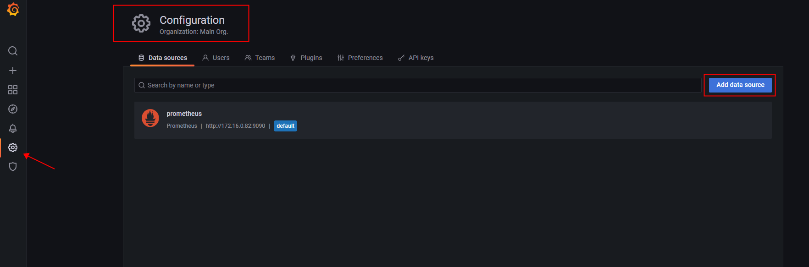

- 配置promethus信息
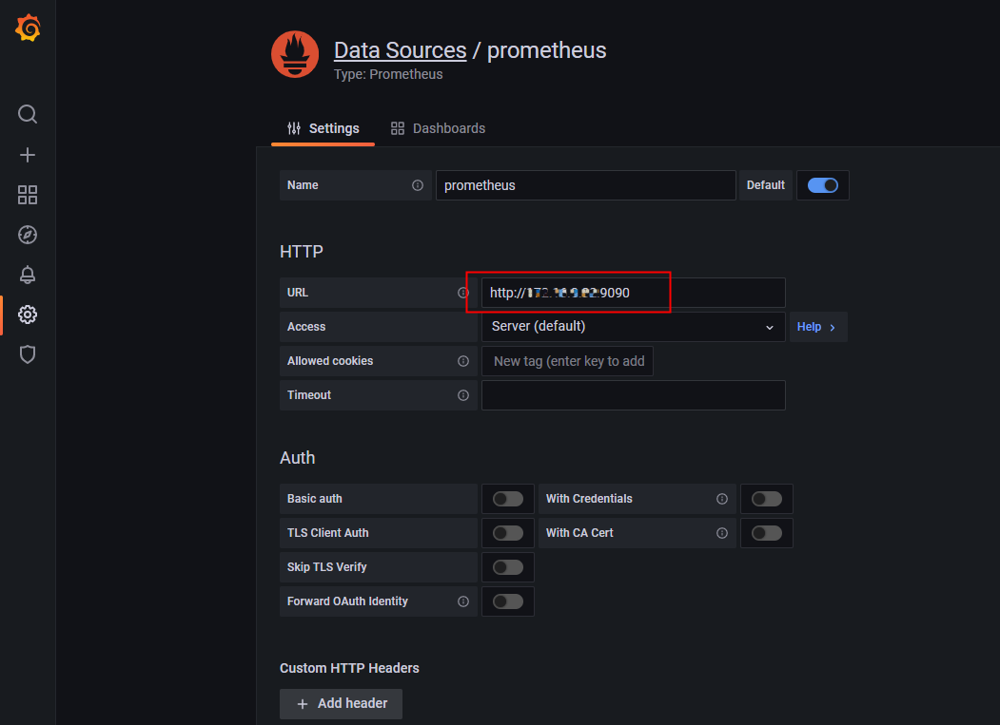

- 导入看板模板
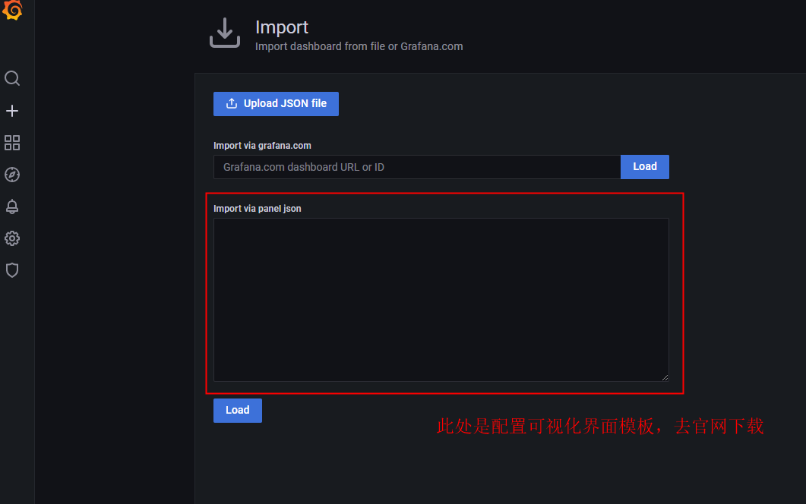

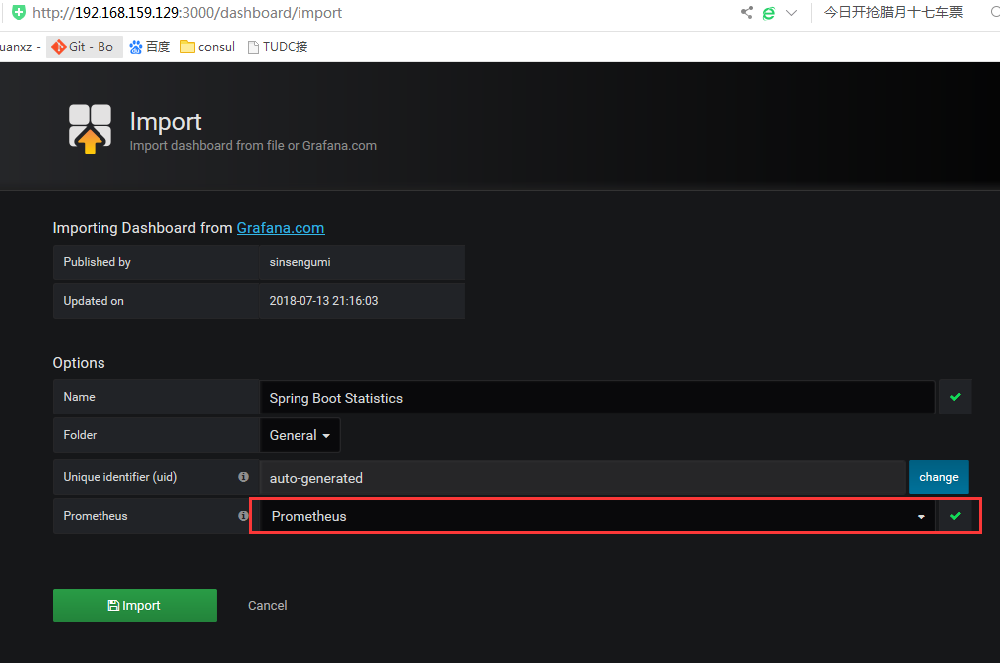

- 在看板页面找到对应的dashboard
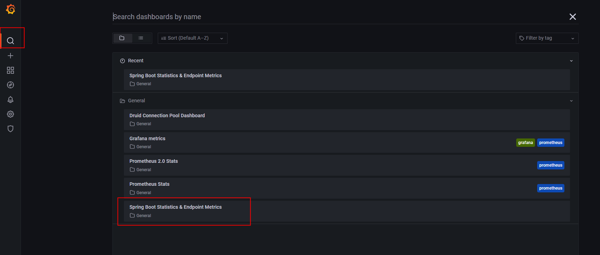


## 设置监控规则
- 新增告警规则
    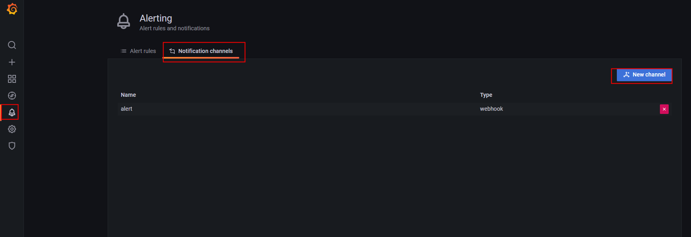
    
    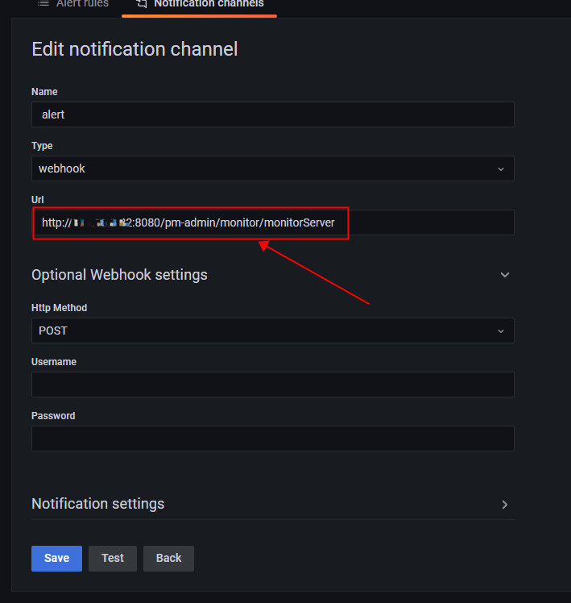

- 根据要监控的数据，配置对应的告警规则
    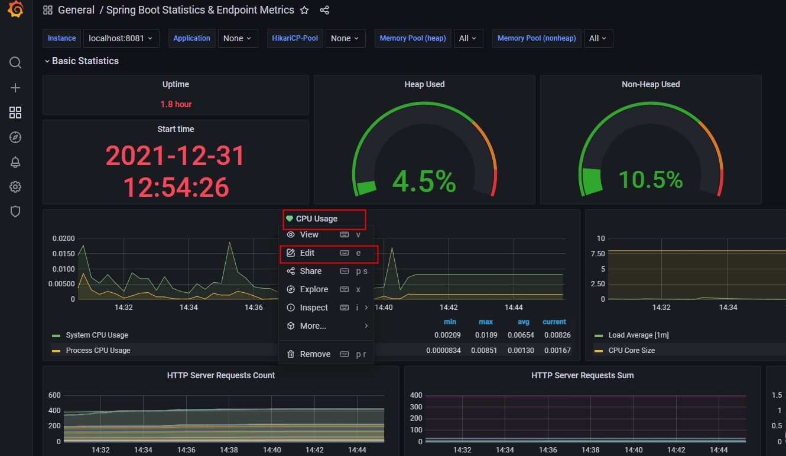
    
    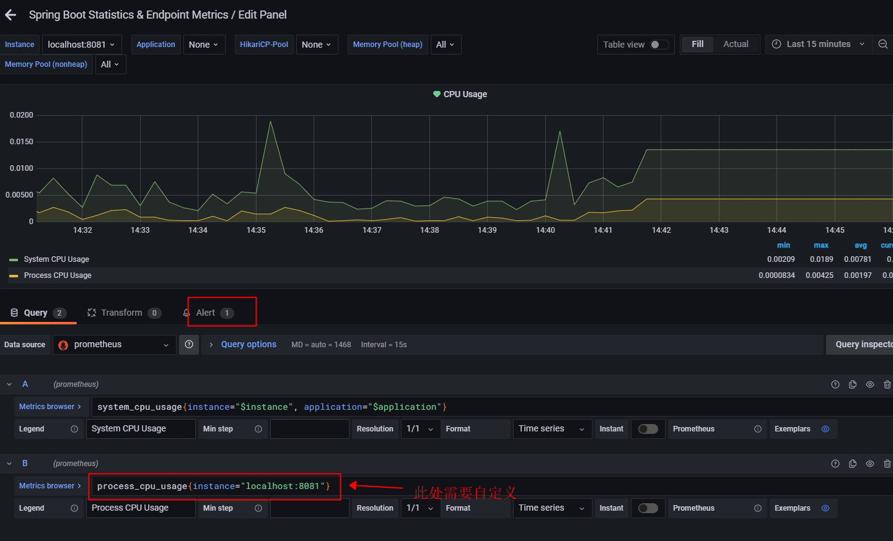
    
    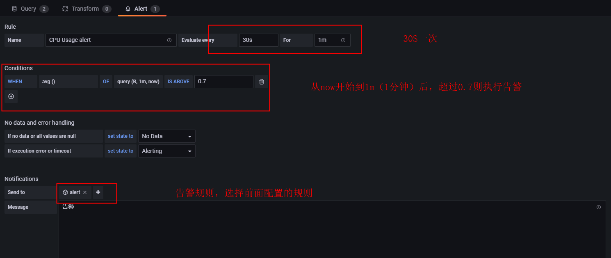
    
- 使用其他服务去调用
    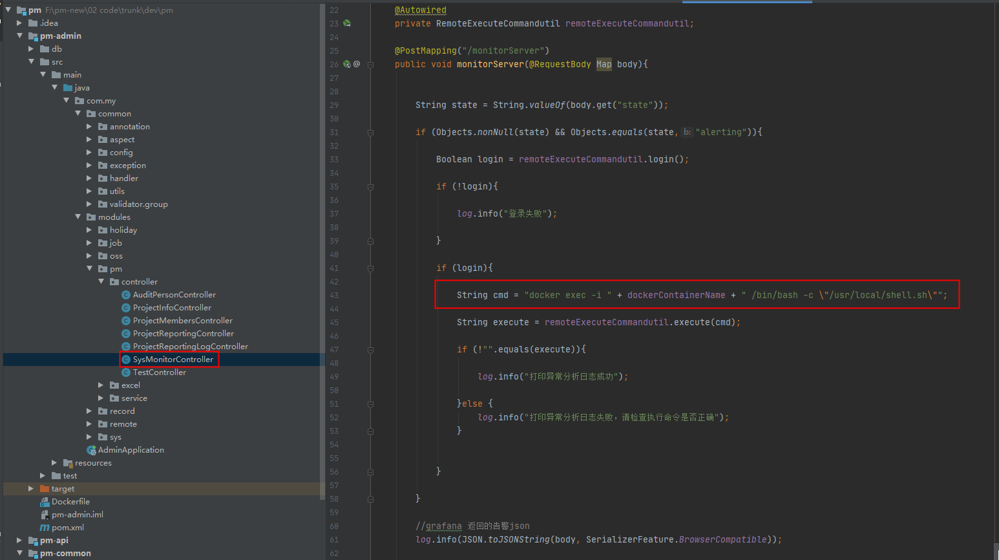
    

- 执行的shell脚本
    ```shell script
    pid=$(top -bn 1 -i -c | awk '{if (NR>6) print }' | awk '{if ($9 > 99) print $1}')
    
    
    currentdate=$(date +"%Y%m%d")
    
    
    if [ "$pid" = "" ]
    then
      echo "没有cpu占用高于99%的数据" >> /var/log/exception/$currentdate".txt"
    else
      pidnew=$(top -H -bn 1 -i -c -p $pid |awk '{if(NR>6) print }'|awk '{if($9>70) print $1}')
    
    fi
    
    echo $pid
    
    echo $pidnew
    
    dec2hex(){
       printf "%x" $1
    }
    
    now=$(date +"%Y-%m-%d %H:%M:%S")
    
    echo $currentdate
    
    for i in ${pidnew[@]};do
    
    a=$(dec2hex $i)
    
    echo "日期："$now" 十六进制进程pid："$a"，十进制进程pid："$i >> /var/log/exception/$currentdate".txt"
    
    jstack $pid|grep -A 10 $a >> /var/log/exception/$currentdate".txt"
    
    echo $a
    
    done
    
    ```
  
> /usr/local  该路径为存放shell脚本的路径
 
> /var/log/exception/ 该路径为生成日志的路径  (该路径要手动生成，不然目录会报空)


