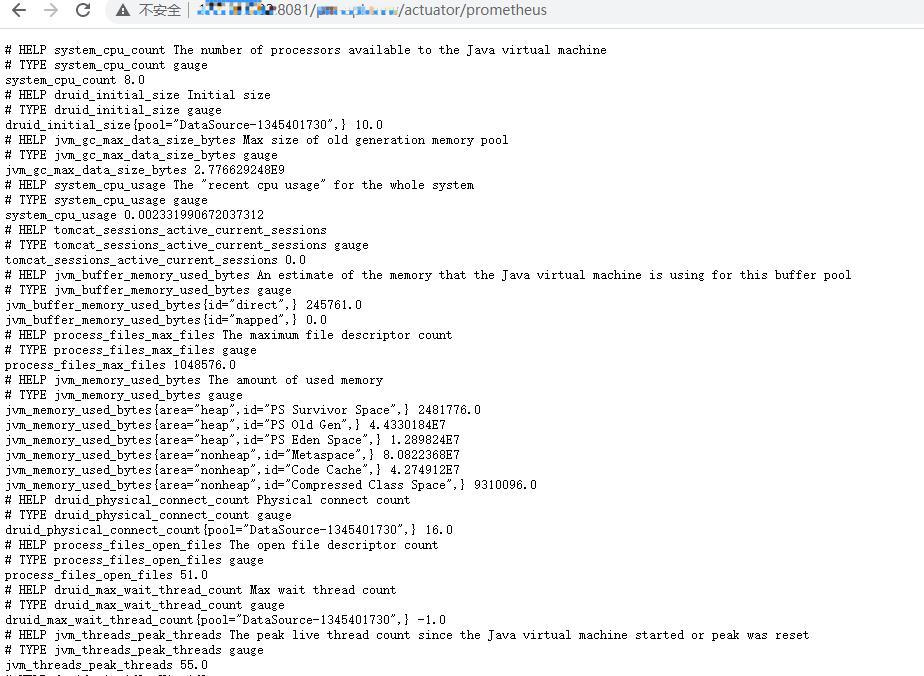
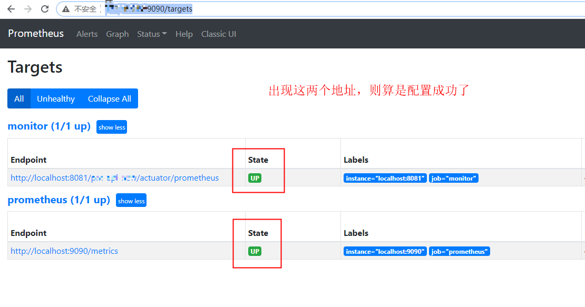

# Springboot配置

- 首先先在引入依赖
```xml
    <dependency>
        <groupId>org.springframework.boot</groupId>
        <artifactId>spring-boot-starter-actuator</artifactId>
    </dependency>
    <dependency>
        <groupId>io.micrometer</groupId>
        <artifactId>micrometer-registry-prometheus</artifactId>
        <version>${prometheus.version}</version>
    </dependency>
```

- 配置yml文件
```yaml
management:
  metrics:
    export:
      prometheus:
        enabled: true
        step: 1m
        descriptions: true
  endpoint:
    prometheus:
      enabled: true
  endpoints:
    web:
      exposure:
        include: health,info,prometheus  #配置地址 对应底下的 promethus 的 metrics_path
  health:
    redis:
      enabled: false  #不需要存到redis
```

- 配置完后，启动服务
    - 注意如果有用shiro控制权限，则需要放开这个地址的权限

> 访问http://[ip]:port/[项目路径]/actuator/prometheus   



- 出现以上内容，则证明springboot配置完成

## 配置promethus

### 去官网，下载最新的包，下载完成后

```shell script
tar xvfz prometheus-*.tar.gz
cd prometheus-*
```

### 修改配置文件
```shell script
vi prometheus.yml
```

```yaml
# my global config
global:
  scrape_interval: 15s # Set the scrape interval to every 15 seconds. Default is every 1 minute. 获取数据的频率（自己百度翻译）
  evaluation_interval: 15s # Evaluate rules every 15 seconds. The default is every 1 minute.     
  # scrape_timeout is set to the global default (10s).

# Alertmanager configuration 未使用alertmanager 这个也是用来做监控消息提醒的，这版本暂时用grafana做监控提醒
alerting:
  alertmanagers:
    - static_configs:
        - targets:
          # - alertmanager:9093

# Load rules once and periodically evaluate them according to the global 'evaluation_interval'.
rule_files:
  # - "first_rules.yml"
  # - "second_rules.yml"

# A scrape configuration containing exactly one endpoint to scrape:
# Here it's Prometheus itself.
scrape_configs:
  # The job name is added as a label `job=<job_name>` to any timeseries scraped from this config.
  # 这个job 指的是当前promethus的地址
  - job_name: "prometheus"

    # metrics_path defaults to '/metrics'
    # scheme defaults to 'http'.

    static_configs:
      - targets: ["localhost:9090"]

    #这个job 用来连接后端服务地址
  - job_name: "monitor"
    scrape_interval: 15s  #设置频率时间
    scrape_timeout: 10s   #设置过期时间
    metrics_path: '/pm-api-new/actuator/prometheus'  #对应java后端的地址   需要引入actuator包
    static_configs:
      - targets: ["localhost:8081"]   #这是目标地址
```

### 启动服务
```shell script
./prometheus --config.file="prometheus.yml"   #这个yml文件就是配置的yml文件
```

- 服务启动成功判断



