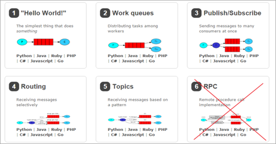
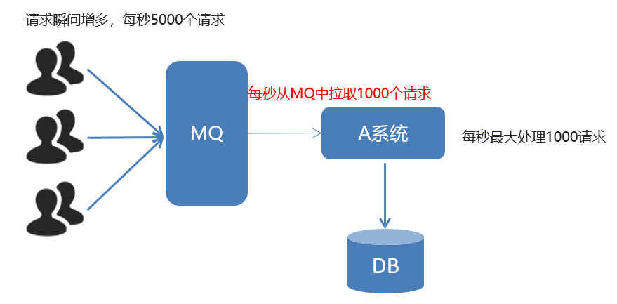
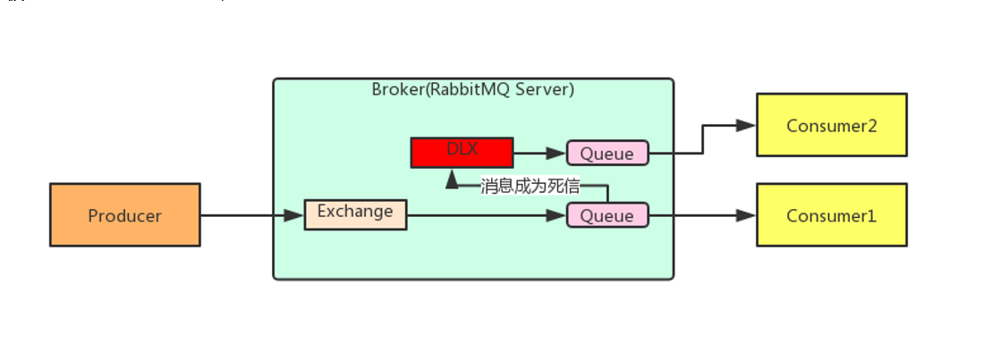
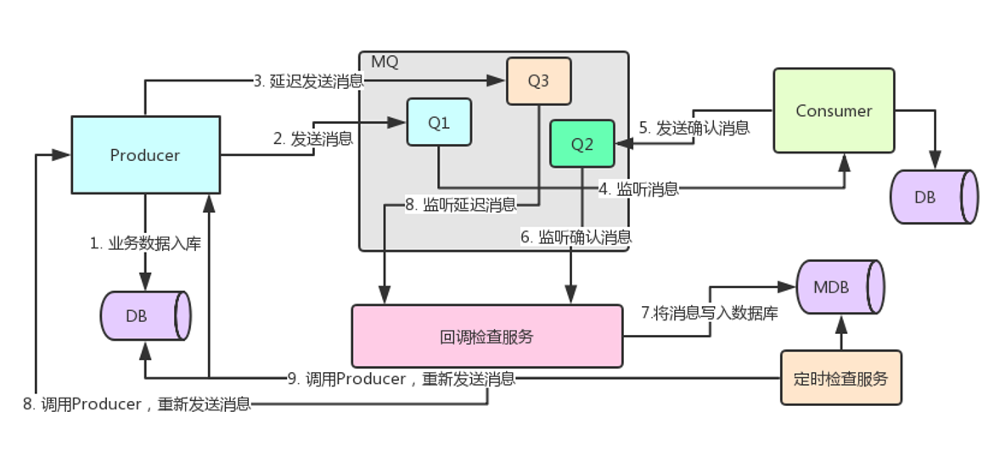

# rabbitMq概念

## 基本概念
* `Broker`：接收和分发消息的应用，RabbitMQ Server就是 Message Broker
* `Virtual host`：出于多租户和安全因素设计的，把 AMQP 的基本组件划分到一个虚拟的分组中，类似于网络中的 namespace 概念。当多个不同的用户使用同一个 RabbitMQ server 提供的服务时，可以划分出多个vhost，每个用户在自己的 vhost 创建 exchange／queue 等
* `Connection`：publisher／consumer 和 broker 之间的 TCP 连接
* `Channel`：如果每一次访问 RabbitMQ 都建立一个 Connection，在消息量大的时候建立 TCP Connection的开销将是巨大的，效率也较低。Channel 是在 connection 内部建立的逻辑连接，如果应用程序支持多线程，通常每个thread创建单独的 channel 进行通讯，AMQP method 包含了channel id 帮助客户端和message broker 识别 channel，所以 channel 之间是完全隔离的。Channel 作为轻量级的 Connection 极大减少了操作系统建立 TCP connection 的开销
* `Exchange`：message 到达 broker 的第一站，根据分发规则，匹配查询表中的 routing key，分发消息到queue 中去。常用的类型有：direct (point-to-point), topic (publish-subscribe) and fanout (multicast)
* `Queue`：消息最终被送到这里等待 consumer 取走
* `Binding`：exchange 和 queue 之间的虚拟连接，binding 中可以包含 routing key。Binding 信息被保存到 exchange 中的查询表中，用于 message 的分发依据


## 六种工作模式
* RabbitMQ 提供了 6 种工作模式：
>简单模式
>
>work queues、
>
>Publish/Subscribe 发布与订阅模式、
>
>Routing 路由模式、
>
>Topics 主题模式、
>
>RPC 远程调用模式
>


## 优缺点

### 优点
* 应用解耦（降低应用间耦合性，提高容错性和维护性）
* 异步提速
* 削峰填谷

### 缺点
* 可用性降低（引入外部依赖多，系统稳定性差）
* 复杂度提高
* 一致性问题


## 消息可靠性
在使用 RabbitMQ 的时候，作为消息发送方希望杜绝任何消息丢失或者投递失败场景。RabbitMQ 为我们提供了两种方式用来控制消息的投递可靠性模式。
* `confirm` 确认模式
* `return`  退回模式

rabbitmq 整个消息投递的路径为：
* producer--->rabbitmq broker--->exchange--->queue--->consumer
* 消息从 producer 到 exchange 则会返回一个 `confirmCallback` 。
* 消息从 exchange-->queue 投递失败则会返回一个 `returnCallback` 。

我们将利用这两个 callback 控制消息的可靠性投递

## 消费者ACK
ack指Acknowledge，确认。 表示消费端收到消息后的确认方式。
有三种确认方式：
* 自动确认：acknowledge="none"
* 手动确认：acknowledge="manual"
* 根据异常情况确认：acknowledge="auto"，（一般采用手动确认）

其中自动确认是指，当消息一旦被Consumer接收到，则自动确认收到，并将相应 message 从 RabbitMQ 的消息缓存中移除。但是在实际业务处理中，很可能消息接收到，业务处理出现异常，那么该消息就会丢失。如果设置了手动确认方式，则需要在业务处理成功后，调用`channel.basicAck()`，手动签收，如果出现异常，则调用`channel.basicNack()`方法，让其自动重新发送消息。

## 消费端限流
通过设置`prefetch`属性，设置消费端一次拉取多少条消息



## TTL(队列的过期时间)
```java
    @Bean("bootQueue")
    public Queue bootQueue(){
        return QueueBuilder.durable(QUEUE_NAME).ttl(500000).build();//ttl设置队列过期时间
    }
```

```java
    //消息过期时间
    rabbitTemplate.convertAndSend(RabbitConfig.EXCHANGE_NAME,"boot.123","尼玛想他吗做梦一样",message -> {
        message.getMessageProperties().setExpiration("10000");//过期时间
        return message;
    });
```
* 设置队列过期时间使用参数：x-message-ttl，单位：ms(毫秒)，会对整个队列消息统一过期。

* 设置消息过期时间使用参数：expiration。单位：ms(毫秒)，当该消息在队列头部时（消费时），会单独判断这一消息是否过期。

* 如果两者都进行了设置，以时间短的为准。

## 死信队列 DLX （Dead Letter Exchange）

### 消息成为死信的情况：
* 队列消息长度达到限制
* 消费者拒接消费消息，basicNack/basicReject,并且`不把消息重新放入`原目标队列,`requeue=false`
* 原队列存在消息过期设置，消息到达超时时间未被消费



## 延迟队列 = TTL+DLX(死信队列)


## rabbitMq linux操作

查看队列
* rabbitmqctl list_queues

查看exchanges
* rabbitmqctl list_exchanges

查看用户
* rabbitmqctl list_users

查看连接
* rabbitmqctl list_connections

查看消费者信息
* rabbitmqctl list_consumers

查看环境变量
* rabbitmqctl environment

查看未被确认的队列
* rabbitmqctl list_queues  name messages_unacknowledged

查看单个队列的内存使用
* rabbitmqctl list_queues name memory

查看准备就绪的队列
* rabbitmqctl list_queues name messages_ready


## 消息补偿



## 幂等性保障
* 乐观锁机制

