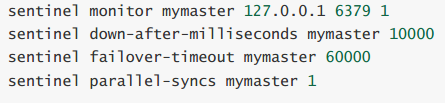
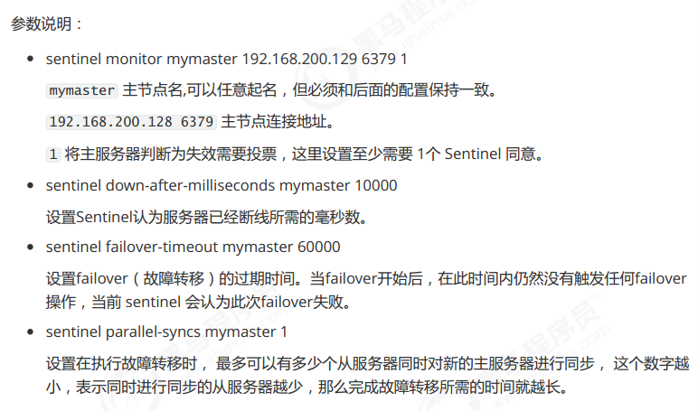

### 1.缓存穿透

> 缓存击穿是指缓存中没有但数据库中有的数据，此时由于并发的用户特别多，同时读缓存没有读到数据，又同时去数据库取数据，引起数据库压力瞬间增大，造成过大的压力

#### 2.解决方案

##### 2.1 redis集群未宕机

- 设置热点数据永远不过期
- 使用缓存预热方案，不直接跟数据库进行交互
- 使用互斥锁进行数据查询

##### 2.2 redis集群宕机

- 使用白名单
> 白名单是指我们将数据库所有的主键都存放在一个map中，如果集群宕机了，对所有的请求都首先查看一下该查询的id是否在map中存在，如果有则房型到数据库中查询，如果没有则直接返回。
>
> 该操作适用在小并发小流量的场景，同时将所有主键存储到内存，比较消耗内存。

- 使用布隆过滤器
> 本质是一个很长的二进制向量和一系列的随机映射函数，优点空间效率和时间都比一般算法好，缺点是删除困难和误识别率。

### 3.缓存雪崩

> 缓存在同一时间大面积失效，后续的请求都往数据库请求，造成数据库段时间承受大量请求

#### 3.1解决方法

- Redis服务不可用：
  
>  采用Redis集群，避免单机出现问题整个缓存服务都没办法使用。
>
>  限流，避免同时处理大量的请求。

-  热点缓存失效：
  
> 设置不同的失效时间比如随机设置缓存的失效时间。
> 
>  缓存永不失效。


### 4 缓存击穿

> 指redis中的某个key，扛着大并发量的请求，当这个key失效的瞬间，大量的并发，穿破缓存，直接往数据库请求。

- 解决方法

> 设置热点的数据永不失效。

### redis集群

#### redis主从复制

- 主节点不做任何修改，在从节点修改redis.conf配置，加入配置：slaveof <主节点的地址> <主节点的端口号>

- 并且需要配置从节点进行读操作，主节点进行写操作，实现读写分离

#### redis 哨兵模式

- 解决主从复制中高可用的问题。





### redis cluster

- redis cluster 为了保证数据的高可用性，加入了主从模式，一个主节点对应一个或多个从节点，主节点
提供数据存取，从节点则是从主节点拉取数据备份，当这个主节点挂掉后，就会在这些从节点中选取一
个来充当主节点，从而保证集群不会挂掉。


#### 安装步骤

```text
# 进入redis安装目录
cd /usr/local/redis
# 复制redis
mkdir cluster
cp -R bin/ cluster/node1
# 删除持久化文件
rm -rf appendonly.aof
# 删除原来的配置文件
rm -rf redis.conf
# 复制新的配置文件
cp /root/redis-4.0.14/redis.conf ./
# 修改配置文件
vi redis.conf
```

- 配置集群环境
```text
# 不能设置密码，否则集群启动时会连接不上
# Redis服务器可以跨网络访问
bind 0.0.0.0
# 修改端口号
port 7001
# Redis后台启动
daemonize yes
# 开启aof持久化
appendonly yes
# 开启集群
cluster-enabled yes
# 集群的配置 配置文件首次启动自动生成
cluster-config-file nodes.conf
# 请求超时
cluster-node-timeout 5000


# 也可以设置密码（每个redis节点配置文件都需要修改）
masterauth passwd123 
requirepass passwd123 

# 后给每个节点执行
./redis-cli -c -p 7001

```

- redis集群需要安装ruby环境

```text
# 安装ruby
yum -y install ruby ruby-devel rubygems rpm-build
# 升级ruby版本，redis4.0.14集群环境需要2.2.2以上的ruby版本
yum install centos-release-scl-rh
yum install rh-ruby23  -y
scl enable rh-ruby23 bash
# 查看ruby版本
ruby -v
```

- 安装gen环境
```text
gem install redis-4.1.0.gem
```

- 启动redis集群

```text
# 进入redis安装包
cd /root/redis-4.0.14/src/
# 查看集群管理脚本
ll *.rb
# 使用集群管理脚本启动集群，下面命令中的1表示为每个主节点创建1个从节点
./redis-trib.rb create --replicas 1 127.0.0.1:7001 127.0.0.1:7002 \
127.0.0.1:7003 127.0.0.1:7004 127.0.0.1:7005 127.0.0.1:7006
```

- 使用redis集群

```text
./redis-cli -h 192.168.200.129 -p 7001 -c
```