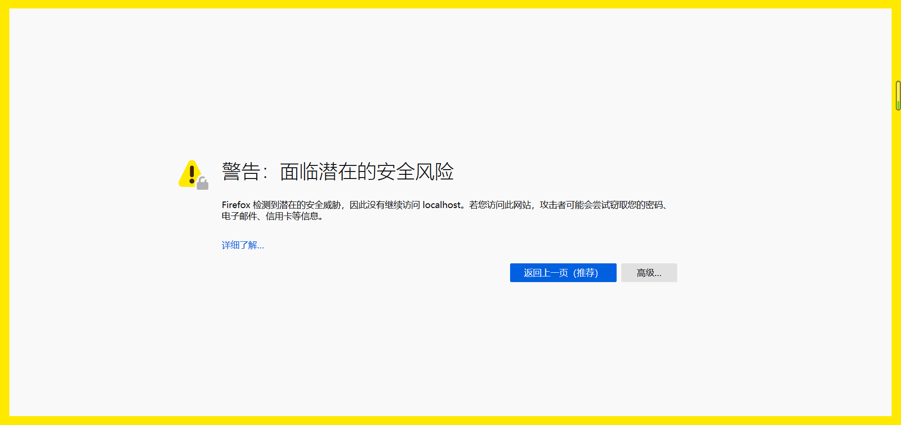
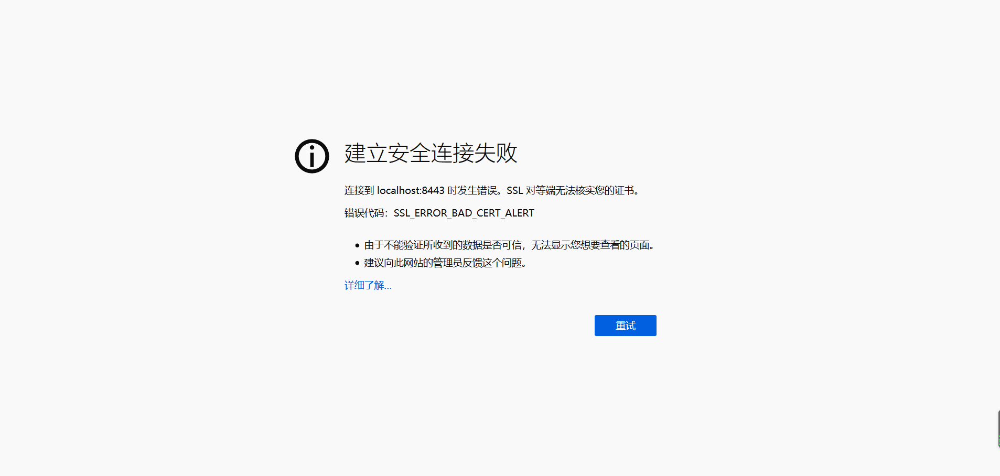
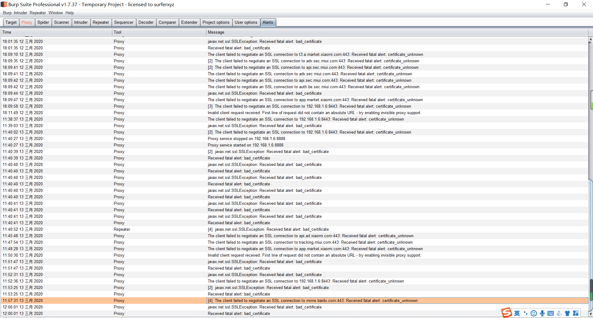
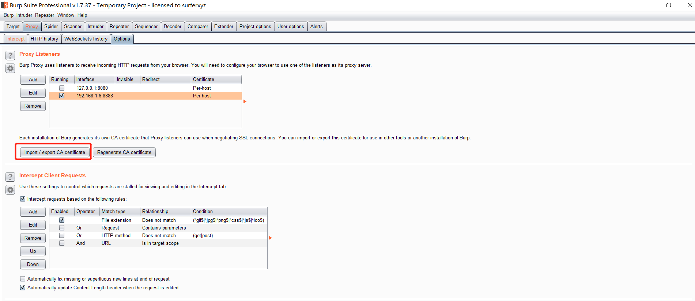
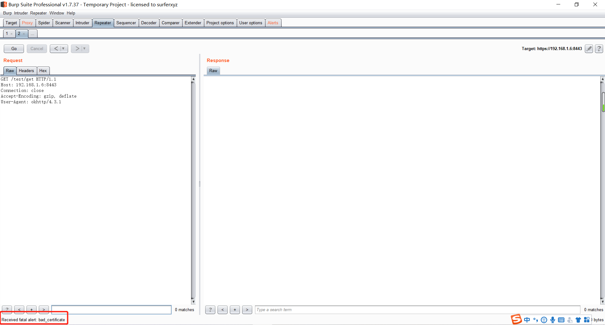
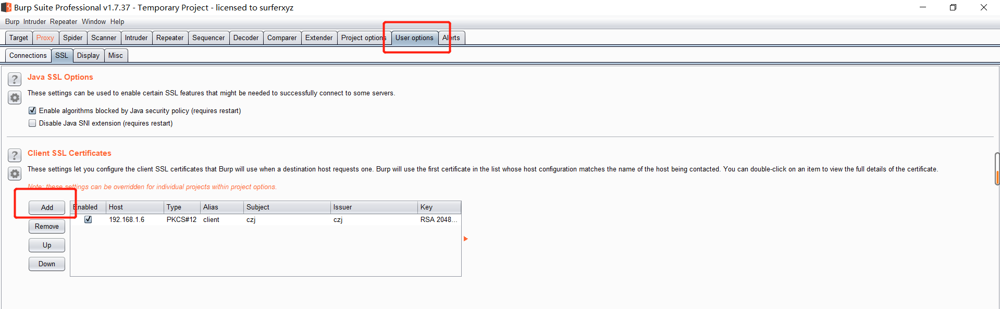

# HTTPS

## HTTPS单向认证
HTTPS单向认证指的是`服务器端认证`，即客户端访问服务器的时候，客户端去校验服务器是否是自己要访问的服务器。如果该服务器不在客户端信任列表中，客户端进行告警。

**如图所示：**



**具体实现：**

1.生成服务端证书
```bash
keytool -genkey -v -alias server -keyalg RSA -storetype PKCS12 -keystore server.key.p12
```
2.对服务端（SpringBoot）进行配置
将步骤1创建的文件`server.key.p12`放在`resource`目录下，然后在`application.yml`中进行如下配置：
```yml
server:
  port: 8443
  ssl:
    key-store: classpath:server.key.p12
    key-alias: server
    enabled: true
    key-store-password: 123456
    key-store-type: PKCS12
```
## HTTPS双向认证

HTTPS双向认证，即在单向认证的基础上，新增服务端对客户端的认证，判断请求是否来自受信任的客户端。如果不是，则请求失败。

**如图所示：**



**具体实现：**

1.生成客户端证书
```bash
keytool -genkey -v -alias client -keyalg RSA -storetype PKCS12 -keystore client.key.p12
```
2.导出客户端公钥
```bash
keytool -keystore client.key.p12 -export -alias qq -file client.cer
```
3.生成证书信任库
```bash
keytool -genkey -v -alias trust -keyalg RSA -storetype PKCS12 -keystore trust.key.p12
```
4.把客户端公钥添加到证书信任库中
```bash
keytool -import -v -file client.cer -keystore trust.key.p12
```
5.导出服务端公钥
```bash
keytool -keystore server.key.p12 -export -alias server -file server.cer
```
6.对服务端（SpringBoot）进行配置
将步骤1创建的文件`server.key.p12`放在`resource`目录下，然后在`application.yml`中进行如下配置：
```yml
server:
  port: 8443
  ssl:
    key-store: classpath:server.key.p12
    key-alias: server
    enabled: true
    key-store-password: 123456
    key-store-type: PKCS12
    protocol: TLS
    client-auth: need
    trust-store: classpath:trust.key.p12
    trust-store-password: 123456
    trust-store-type: JKS
    trust-store-provider: SUN
```
7.将客户端证书`client.key.p12`及服务端公钥`server.cer`配置到客户端

## Android客户端实现HTTPS
**具体实现**

1.Android平台不识别.p12和.jks格式的证书库文件，因此需要将上面生成的证书转换成.bks格式，另client.key.p12证书需要通过`portecle`工具进行格式转换，最后得到client.bks和server.bks两个证书
```bash
keytool -importcert -trustcacerts -keystore server.bks -file server.cer -storetype BKS -provider 
org.bouncycastle.jce.provider.BouncyCastleProvider
```
2.加载客户端证书`client.bks`，此为客户端证书，供服务端验证客户端
```java
KeyStore keyStore = KeyStore.getInstance("BKS");
InputStream ksIn = context.getAssets().open("client.bks");
keyStore.load(ksIn, PASSWORD.toCharArray());
ksIn.close();
```
3.加载服务端证书`server.bks`，此为客户端信任的证书，供客户端验证服务端
```java
KeyStore trustStore = KeyStore.getInstance(KEYSTORE_TYPE);
InputStream tsIn = context.getAssets().open(TRUSTSTORE_PUB_KEY);
trustStore.load(tsIn, PASSWORD.toCharArray());
tsIn.close();
```
4.获取`KeyManagerFactory`，选择客户端证书，为客户端添加身份证明
```java
KeyManagerFactory keyManagerFactory = KeyManagerFactory.getInstance("X509");
keyManagerFactory.init(keyStore, PASSWORD.toCharArray());
```
5.获取`TrustManagerFactory`，选择服务端证书，添加客户端信任
```java
TrustManagerFactory trustManagerFactory = TrustManagerFactory.getInstance("X509");
trustManagerFactory.init(trustStore);
```
6.获取`SSLSocketFactory`对象，供OKHttp使用
```java
SSLContext sslContext = SSLContext.getInstance("TLS");
sslContext.init(keyManagerFactory.getKeyManagers(), trustManagerFactory.getTrustManagers(), new SecureRandom());
sslSocketFactory = sslContext.getSocketFactory();
```
7.使用`Okhttp`请求数据
```java
OkHttpClient okHttpClient=new OkHttpClient().newBuilder()
    .sslSocketFactory(SSLHelper.getSSLCertifcation(context), new X509TrustManager() {
        @Override
        public void checkClientTrusted(X509Certificate[] chain, String authType) throws CertificateException {
            //无须重写
        }

        @Override
        public void checkServerTrusted(X509Certificate[] chain, String authType) throws CertificateException {
            //无须重写
        }
        @Override
        public X509Certificate[] getAcceptedIssuers() {
            return new X509Certificate[0];
        }
    })
    .hostnameVerifier(new HostnameVerifier() {
        @Override
        public boolean verify(String hostname, SSLSession session) {
            return true;
        }
    })
    .build();
    
    Request request=new Request.Builder().url("https://192.168.1.6:8443/test/get").get().build();
    Call call=okHttpClient.newCall(request);
    call.enqueue(new Callback() {
        @Override
        public void onFailure(@NotNull Call call, @NotNull IOException e) {
            ...
        }
    
        @Override
        public void onResponse(@NotNull Call call, @NotNull Response response) throws IOException {
            ...
        }
    });
```
**实现效果**

当Android客户端进行双向认证后，使用`Burpsuite`进行报文拦截，会提示如下图所示错误（certificate_unknown）



## BurpSuite拦截HTTPS双向认证报文

**具体实现**

1.通过BurpSuite导入服务端证书`server.key.p12`



2.此时便可以通过BurpSuite拦截到请求报文了



3.当然这还不够，目前为止只是客户端认可了BurpSuite作为代理服务端，我们还需要让服务端认可BurpSuite，
通过下图所示导入客户端证书`client.key.p12`



